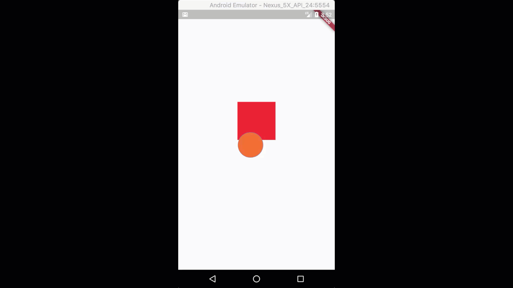
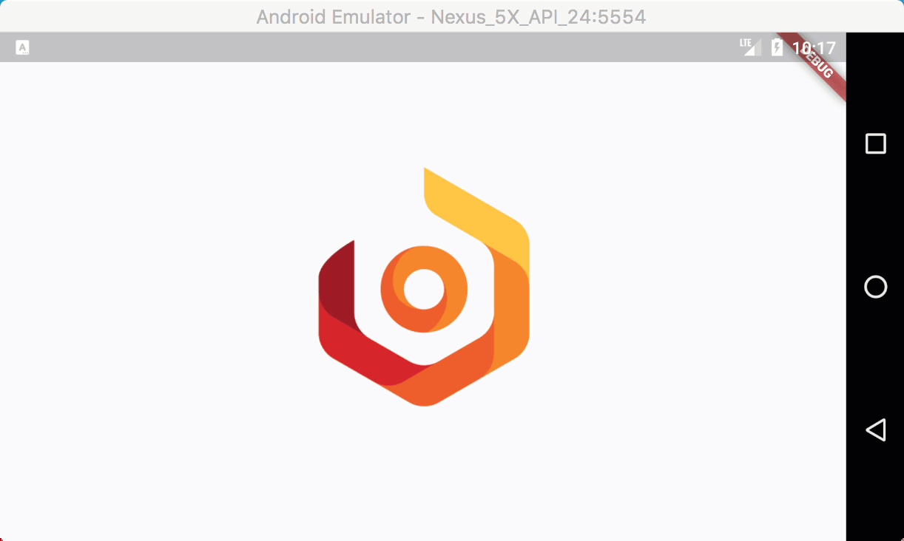

# nc_flutter_util

A new Flutter application.

## Getting Started

For help getting started with Flutter, view our online
[documentation](https://flutter.io/).

Source tag: 

### Demo1
Flutter custom indicator animation simple: https://medium.com/p/2c487489040b

### Demo2
Flutter curves simulation: https://medium.com/p/f935bb225ad2

### Demo3
Flutter simple particle motion: https://medium.com/p/3b48fd1f182

### Demo4
Flutter combine matrix transaction animation

### Demo5
Flutter wave clipper animation

### Handwriting animation
Funny handwriting animation: https://medium.com/p/1183029b825b 

